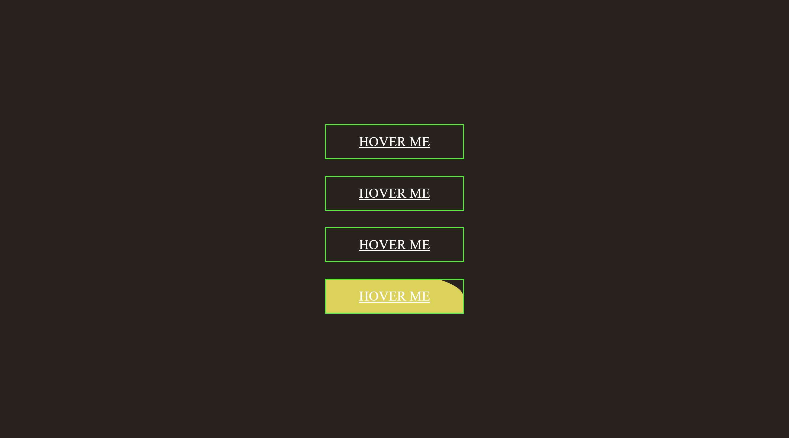

# CSS Hover Effect

## Table of contents

- [CSS Hover Effect](#css-hover-effect)
  - [Table of contents](#table-of-contents)
    - [Screenshot](#screenshot)
    - [Links](#links)
    - [Built with](#built-with)
  - [Author](#author)

### Screenshot

.png>)
.png>)
.png>)
.png>)

### Links

- Solution URL: (https://github.com/Ikenna04/css-hover-effect)
- Live Site URL: (https://ikenna04.github.io/css-hover-effect/)

### Built with

- Semantic HTML5 markup
- CSS custom properties
- Flexbox

## Author

EZEORAH IKENNA PASCHAL

<!-- - Website - [Add your name here](https://www.your-site.com) -->

- Frontend Mentor - [@Ikenna04](https://www.frontendmentor.io/profile/Ikenna04)
- Twitter - [@ikenna004](https://www.twitter.com/ikenna004)
